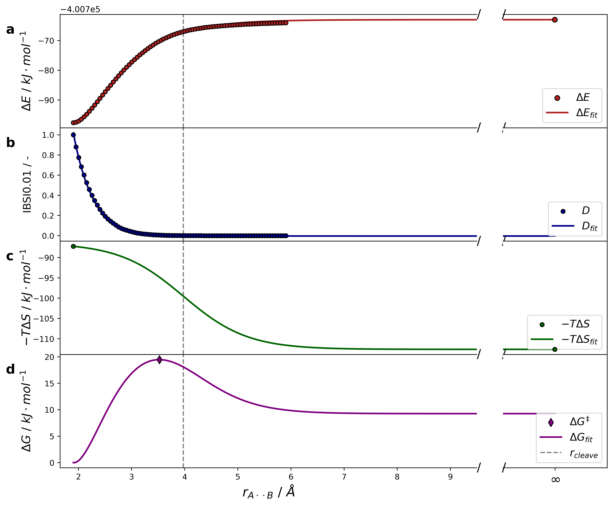

# DORA: Transition State Explorer (v1.a)

**DORA** is a Python class for analyzing molecular dissociation pathways. It identifies the transition state by fitting energy and entropy data along a reaction coordinate using physical models. The characterization of the transition state is done using a quantum chemical descriptor of choice.

## Features

- Fits a descriptor of dissociation scan using an exponential decay.
- Determines the cleaving point using said descriptor unless manually specified.
- Fits electronic energy scan (`dE`) using a Morse potential.
- Approximates entropy contributions (`TdS`) with a sigmoid function, using entropic contributions of both equilibrium structures (`TdS_AB` and `TdS_A` + `TdS_B`).
- Calculates Gibbs free energy (`dG = dE + TdS`) and localizes the transition state.

## Requirements

- Python 3
- NumPy
- SciPy


## Usage

```
from dora import DORA

# Example data (replace with your actual values)
descriptor_data = [...]                                   # List containing data of chosen descriptor D(r)
distance_data = [...]                                     # List with intramolecular distances between the dissociating fragments
dE_data = [...]                                           # List containing electronic energies for the dissociation scan
dE_A = ...                                                # Electronic energy of the fragment A
dE_B = ...                                                # Electronic energy of the fragment B
TdS_AB = ...                                              # -TdS of the educt structure AB
TdS_A = ...                                               # -TdS of the fragment structure A
TdS_B = ...                                               # -TdS of the fragment structure B
y_cleave ...                                              # Parameter that defines bond breaking (default: 0.02)


model = DORA(descriptor_data, distance_data, dE_data,     # Initializes DORA calculation with given parameters
             dE_A, dE_B, TdS_AB, TdS_A, TdS_B)

input_data, output_data = model.run()                     # runs DORA calculation and saves given input and output data in input_data and output_data, respectively
plotter(model.run())                                      # runs calculation and plots results 
```


## Optional Input Parameters
```
k_start                                                   # starting value for k for the iterative adjustment of the  steepness of the -TdS-fit  (default: 10)
max_iteration                                             # maximum number of iterations for the steepness adjustment (default: 1000)
k_step                                                    # stepsize dk (default: 0.1)
r_cleave = 0                                              # manually choice for r_cleave (default: 0, meaning that this parameter will be determined using the descriptor)
D_name                                                    # Name of the descriptor for output plot (default: "Descriptor")
infinite_distance                                         # distance in Angström, at which the fragments are to be treaded as infinitely separated (default: 10)
tightness                                                 # how tight the spacing of the output surface list should be (default: 0.01, meaning that the output lists contain datapoints corresponding to r being spaced in 0.01 Angström steps)
```

## Outputs
```
# the DORA.run() function returns two lists, OutputData and InputData
self.OutputData = [self.tight_distance,                   # List containing the r values corresponding to the set value of tightness 
                    self.dE_fit,                          # List containing data points for the electronic energy fit
                    self.descriptor_fit,                  # List containing data points for the exponential descriptor fit
                    self.TdS_fit,                         # List containing data points for the -TdS fit
                    self.dG_fit,                          # List containing data points for the Gibbs free energy fit
                    self.r_cleave,                        # Value of the found r_cleave value
                    self.dG_TS,                           # Value of the found free energy barrier
                    self.r_TS,                            # Intramolecular distance of the found transition state
                    self.k]                               # Value of k after the last iteration
                    

# Input data specified in initialization (see Usage and Optional Input Parameters)
self.InputData = [self.descriptor_data,
self.distance_data,
self.dE_data,
[self.TdS_A,
self.TdS_B,
self.TdS_AB],
self.infinite_distance ]
```

## Example output plot

Optinally, the user can print an output plot for the DORA calculation. Note that a visual examination may help spot mistakes in the setup of the calculation.


