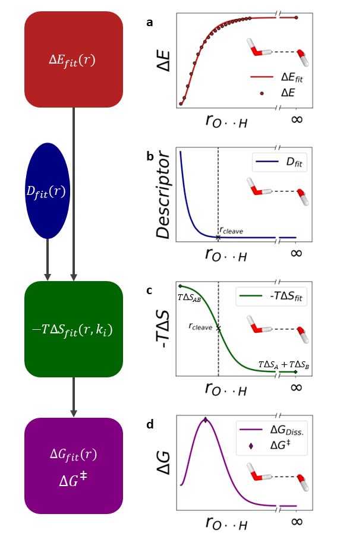

# DORA: Transition State Explorer (v1.a)

**DORA** is a Jupyter Notebook for analyzing barrierless molecular dissociation reactions. It identifies the transition state by fitting energy and entropy data along a reaction coordinate using physical models. The characterization of the transition state is done using a quantum chemical descriptor of choice.




## Features

- Fits a descriptor of dissociation scan using an exponential decay.
- Determines the cleaving point using said descriptor unless manually specified.
- Fits electronic energy scan (`dE`) using a Morse potential.
- Approximates entropy contributions (`TdS`) with a sigmoid function, using entropic contributions of both equilibrium structures (`TdS_AB` and `TdS_A` + `TdS_B`).
- Calculates Gibbs free energy (`dG = dE + TdS`) and localizes the transition state.

## Requirements

- Python 3
- NumPy
- SciPy


## Usage

In order to calculate dissociation barriers with DORA, the user has to first calculate the following data using a quantum chemical program of choice:

- The electronic energy of a (relaxed) surface scan of the system in question. This can be done by increasing the intramolecular distance between the atoms participating in the bond, that should be broken during the dissociation process, while optimising the geometries for each step. [Here](https://www.faccts.de/docs/orca/6.1/manual/contents/structurereactivity/optimizations_scans.html?q=relaxed+surface+scan&n=0#surface-scans) you can find instructions on how this can be done in [ORCA 6.1.](https://www.faccts.de/orca/) Note that for some cases, certain geometry restrains can be invoked, to counteract any unwanted behaviour during the dissociation process.
- Data of the descriptor of choice for each structure resulting from the dissociation scan. We recommend the Intrinsic Bond Strength Index (IBSI), which can be computed using the wave-analysis program [Multiwfn](http://sobereva.com/multiwfn/). Note that this method relies on the fact that the descriptor used shows an exponentially decaying behaviour.
- The intramolecular distance gained from the (relaxed) surface scan.
- The entropic contributions of the optimzed educt structure
- The electronic energy of both fragments, individually
- The entropic contributions of both fragments, individually

Below, one can find a description of the input variables for DORA. The user is also provided a dummy example in the Notebook itself for ease of usage.

```
from dora import DORA

# Example data (replace with your actual values)
descriptor_data = [...]                                   # List containing data of chosen descriptor D(r)
distance_data = [...]                                     # List with intramolecular distances between the dissociating fragments
dE_data = [...]                                           # List containing electronic energies for the dissociation scan
dE_A = ...                                                # Electronic energy of the fragment A
dE_B = ...                                                # Electronic energy of the fragment B
TdS_AB = ...                                              # -TdS of the educt structure AB
TdS_A = ...                                               # -TdS of the fragment structure A
TdS_B = ...                                               # -TdS of the fragment structure B
y_cleave ...                                              # Parameter that defines bond breaking (default: 0.02)


model = DORA(descriptor_data, distance_data, dE_data,     # Initializes DORA calculation with given parameters
             dE_A, dE_B, TdS_AB, TdS_A, TdS_B)

results = model.run()                     # Runs DORA calculation and saves given input and output data

plotter(results)                          # Generates an optional plot to visualize the results

PrintFits(results, savepath)              # Creates two files, containing the datapoints of all the fit-functions and a file containing the results and important parameters: DORA_Fit_data.dat and DORA_Results.dat
```


## Optional Input Parameters
```
k_start                                                   # starting value for k for the iterative adjustment of the  steepness of the -TdS-fit  (default: 10)
max_iteration                                             # maximum number of iterations for the steepness adjustment (default: 1000)
k_step                                                    # stepsize dk (default: 0.1)
r_cleave = 0                                              # manually choice for r_cleave (default: 0, meaning that this parameter will be determined using the descriptor)
D_name                                                    # Name of the descriptor for output plot (default: "Descriptor")
infinite_distance                                         # distance in Angström, at which the fragments are to be treaded as infinitely separated (default: 10)
tightness                                                 # how tight the spacing of the output surface list should be (default: 0.01, meaning that the output lists contain datapoints corresponding to r being spaced in 0.01 Angström steps)
```

## Outputs
```
# the DORA.run() function returns two lists, OutputData and InputData
self.OutputData = [self.tight_distance,                   # List containing the r values corresponding to the set value of tightness 
                    self.dE_fit,                          # List containing data points for the electronic energy fit
                    self.descriptor_fit,                  # List containing data points for the exponential descriptor fit
                    self.TdS_fit,                         # List containing data points for the -TdS fit
                    self.dG_fit,                          # List containing data points for the Gibbs free energy fit
                    self.r_cleave,                        # Value of the found r_cleave value
                    self.dG_TS,                           # Value of the found free energy barrier
                    self.r_TS,                            # Intramolecular distance of the found transition state
                    self.k]                               # Value of k after the last iteration
                    

# Input data specified in initialization (see Usage and Optional Input Parameters)
self.InputData = [self.descriptor_data,
self.distance_data,
self.dE_data,
[self.TdS_A,
self.TdS_B,
self.TdS_AB],
self.infinite_distance ]
```

## Example output plot

Optinally, the user can print an output plot for the DORA calculation. Note that a visual examination may help spot mistakes in the setup of the calculation.


